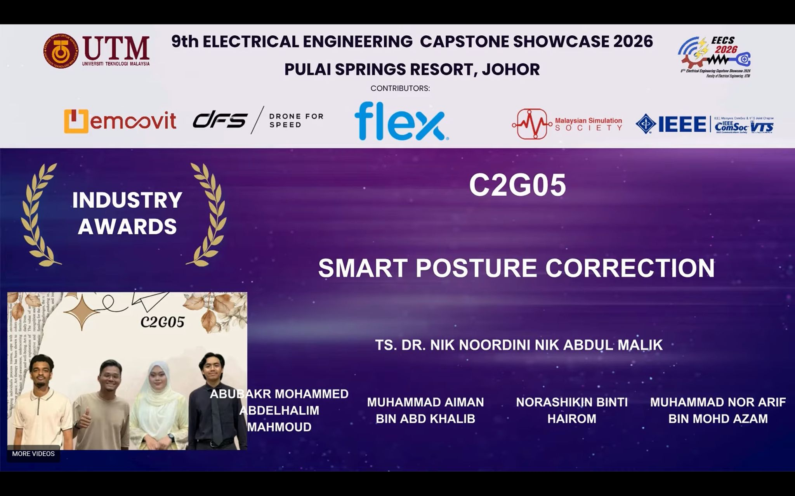
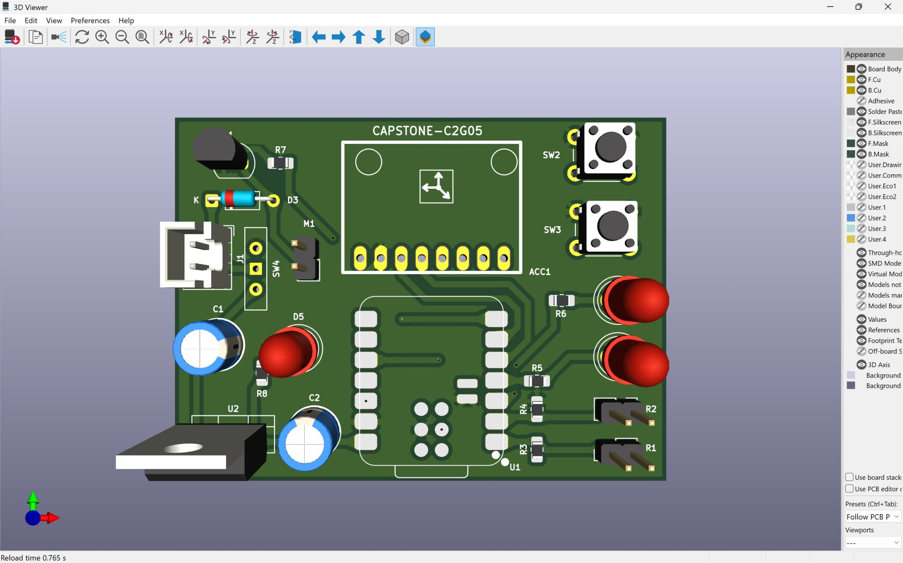
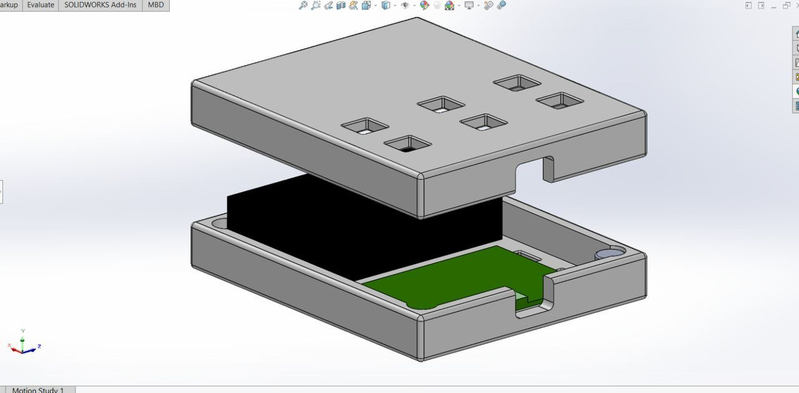

# Smart Posture Correction System

> **🏆 Industry Award Winner — 9th EE Capstone Showcase (EECS 2026)**  
> Universiti Teknologi Malaysia · Pulai Springs Resort, Johor · January 2026

A full-stack wearable IoT system that monitors and corrects sitting posture in real-time by fusing **computer vision** (webcam + dlib face pose estimation) with **onboard inertial sensing** (flex sensor + MPU6050 IMU), delivering haptic vibration feedback via a custom PCB worn on the upper back.

---

## Gallery

<p align="center">
  
  
  
</p>

<p align="center">
  
  
</p>

---

## System Architecture

```
┌─────────────────────────────────────────────────────────────┐
│                   COMPUTER (Python Host)                    │
│                                                             │
│  Webcam → dlib 68-point landmarks → solvePnP head pose     │
│  7-frame rolling pitch average → classify posture           │
│  UDP '1' (bad) / '0' (good) ──────────────────────────────►│
└────────────────────────────────────────────────────┬────────┘
                                                     │ WiFi UDP
                                    ┌────────────────▼────────┐
                                    │   XIAO ESP32-C3 (PCB)   │
                                    │                         │
                                    │  FSR 402 ──► Wear detect│
                                    │  MPU6050 ──► Tilt angle │
                                    │  Flex sensor ► Spine    │
                                    │                         │
                                    │  Combined trigger:      │
                                    │  (hardware OR webcam)   │
                                    │       ↓                 │
                                    │  Vibration motor PWM    │
                                    │  (variable intensity)   │
                                    └─────────────────────────┘
```

### Key Design Decisions
- **Dual-modality sensing**: Hardware sensors (flex + IMU) catch posture deviation even when the camera is off. Computer vision adds head-neck pose — catching forward-head syndrome that body sensors miss.
- **FSR debouncing**: 2-second timer prevents false device-removal resets during brief pressure shifts.
- **3-second calibration**: On first sit-down, the IMU records the user's personal "upright" reference angle — adapts to different chairs and postures.
- **Variable haptic intensity**: Motor PWM scales with how far the flex sensor has deviated, giving proportional feedback rather than a binary buzz.
- **Webcam timeout safety**: If the Python host disconnects, the bad-posture flag clears after 2 seconds — no false alerts.

---

## Repository Structure

```
smart-posture-correction/
├── firmware/
│   └── posture_monitor.ino     # ESP32-C3 Arduino sketch (WiFi + UDP + sensors)
├── vision/
│   ├── posture_detection.py    # Python CV pipeline (dlib + solvePnP + UDP)
│   └── requirements.txt        # Python dependencies
├── hardware/
│   └── README.md               # PCB & enclosure file locations + BOM
└── README.md                   # This file
```

---

## Hardware

### Custom PCB — CAPSTONE-C2G05
Designed in **KiCad**, fabricated as a 4-layer board.

| Component | Part | Function |
|-----------|------|----------|
| MCU | Seeed XIAO ESP32-C3 | WiFi, BLE, ADC, I2C host |
| Regulator | LM7805 (TO-220) | 9V battery → 5V |
| Motor driver | S8050 NPN BJT | PWM-controlled vibration motor |
| IMU | MPU6050-compatible | 3-axis accelerometer (back tilt) |
| Flex sensor | Resistive bend sensor | Spine curvature detection |
| FSR | FSR 402 | Wear detection (pressure under strap) |

### Enclosure
Designed in **SolidWorks** — compact ergonomic shell with magnet-clip assembly for tool-free opening. 3D-printed in PLA.

### Wiring Quick-Reference
```
XIAO GPIO 2  → Flex sensor (ADC, voltage divider)
XIAO GPIO 3  → FSR 402 (ADC, voltage divider)
XIAO GPIO 21 → S8050 base (1kΩ) → vibration motor
XIAO GPIO 6  → MPU6050 SDA
XIAO GPIO 7  → MPU6050 SCL
Power: 9V battery → LM7805 → 5V → XIAO (internal 3.3V LDO)
```

---

## Setup Guide

### Prerequisites

**Hardware:**
- Seeed XIAO ESP32-C3 (or compatible ESP32-C3 board)
- MPU6050 accelerometer module
- Flex sensor + FSR 402
- 5V vibration motor
- S8050 NPN transistor + 1kΩ resistor + flyback diode
- 9V battery + LM7805 regulator (or 5V USB power bank)

**Software:**
- Arduino IDE 2.x with [ESP32 board package](https://docs.espressif.com/projects/arduino-esp32/en/latest/installing.html)
- Python 3.8+
- `shape_predictor_68_face_landmarks.dat` — download from [dlib.net](http://dlib.net/files/shape_predictor_68_face_landmarks.dat.bz2) and extract into the `vision/` folder

### Step 1 — Flash the Firmware

1. Open `firmware/posture_monitor.ino` in Arduino IDE
2. Edit the WiFi credentials at the top:
   ```cpp
   const char* STASSID = "YOUR_WIFI_NAME";
   const char* STAPSK  = "YOUR_WIFI_PASSWORD";
   ```
3. Select board: **XIAO_ESP32C3** (or ESP32C3 Dev Module)
4. Upload. Open Serial Monitor (115200 baud) and note the **IP address** printed after WiFi connects.

### Step 2 — Configure the Python Script

1. Install dependencies:
   ```bash
   cd vision
   pip install -r requirements.txt
   ```
2. Edit `posture_detection.py` — set the ESP32 IP from Step 1:
   ```python
   ESP_IP = "192.168.x.x"   # ← paste your ESP32's IP here
   ```

### Step 3 — Run

```bash
cd vision
python posture_detection.py
```

The webcam window will open. Sit in your normal upright position for 3 seconds after the wearable buzzes twice (calibration). The motor will vibrate when bad posture is detected.

**Press `q` to quit the webcam window.**

---

## Posture Classification Logic

The Python script uses a **7-frame rolling average** of the head pitch angle (from `solvePnP` decomposition):

| Average Pitch (°) | Classification | Alert |
|-------------------|----------------|-------|
| -2 to +2 | Sitting Straight | ✅ Good |
| -17 to -2 | Inclined (relaxed) | ✅ OK |
| +2 to +17 | Humped Back | ❌ Bad → Vibrate |
| > +17 | Looking Down | ❌ Bad → Vibrate |
| < -17 | Overly Inclined | ❌ Bad → Vibrate |

---

## Tech Stack

| Layer | Technology |
|-------|-----------|
| MCU Firmware | C++ / Arduino (ESP32 Arduino Core) |
| Computer Vision | Python, OpenCV, dlib, NumPy |
| Communication | WiFi 802.11n, UDP (port 4210) |
| PCB Design | KiCad 7 (4-layer) |
| Enclosure CAD | SolidWorks 2023 → STL |
| IoT Dashboard | Blynk IoT (virtual pins V0–V7) |

---

## Results

- Achieved reliable posture classification with **<200 ms end-to-end latency** (camera → classification → vibration)
- Successfully demonstrated at the UTM EE Capstone Showcase (EECS 2026) to industry judges — awarded **Best Industry Project**
- Wearable runs for ~4 hours on a 9V alkaline battery

---
## Gallery


[Award Ceremony](images/award_ceremony2.jpg)
[Award Ceremony](images/award_ceremony3.jpg)
[Award Ceremony](images/solidworks_casing.jpg)


## Authors

**Abubakr M. Abdelhalim** — Electronics Design, PCB Layout, Firmware, Computer Vision Integration  
Universiti Teknologi Mal